<p align="center">
  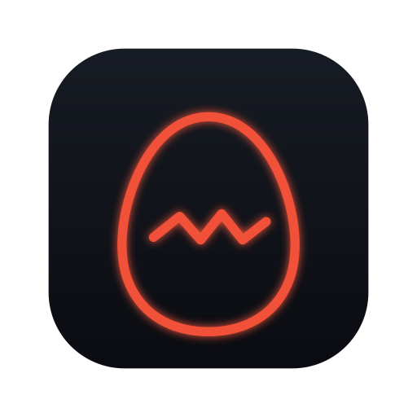
</p>

<h1 align="center">PokeTokenBar for Win</h1>

<p align="center">
  <strong>Turn local AI coding usage into Pokémon progress.</strong><br>
  A quiet tray companion that turns everyday development into a small collection game.
</p>

<p align="center">
  <a href="https://github.com/MarkusSela/PokeTokenBarWindows-Lab/actions/workflows/ci.yml"></a>
  <a href="https://github.com/MarkusSela/PokeTokenBarWindows-Lab/releases"></a>
  <a href="LICENSE"></a>
</p>

> **Current release: v0.1.0**

## About this project

PokeTokenBar is an independent desktop companion inspired by the original [PokeTokenBar project](https://github.com/chattymin/PokeTokenBar). This repository contains the Windows build, with the same simple idea at its centre: local AI coding usage becomes an egg, then a companion, then a growing Pokédex.

The app stays in the notification area and opens a compact Home panel when you need it. Your provider data remains on the machine, while the companion keeps its own progression state separately.

## ✨ What it does

- 🥚 **Turns usage into progress:** local usage feeds the active egg, which can hatch, evolve, and graduate.
- 📊 **Shows the numbers that matter:** see daily, weekly, monthly, and rolling usage when the source provides it.
- 📚 **Builds a collection:** keep graduated companions in the Pokédex and review each individual in the Catch Log.
- 🛍️ **Adds a small reward loop:** use the Shop and Bag for eggs, Rare Candy, Mints, and other progression items.
- 🫧 **Stays out of the way:** open Home from the tray or keep an optional floating companion on screen without adding another taskbar button.
- 📁 **Accepts extra local sources:** add JSON or JSONL folders when a tool stores usage outside the built-in locations.
- 🔒 **Keeps the boundary clear:** provider data is read-only, and the app does not need a server, SSH, Tailscale, Home Assistant, or a remote usage service.

## 🔁 How progression works

1. The app reads supported usage metadata locally.
2. New usage advances the active egg.
3. The egg hatches into a Pokémon selected from the built-in catalogue.
4. More progress unlocks evolution stages and eventually graduates the companion.
5. The Pokédex and Catch Log keep the local collection history.

The progression state belongs to PokeTokenBar. It does not write back to Hermes or to any provider source.

## 📸 Screenshots

The screenshots below use synthetic values and neutral demo paths. Each image sits beside an explanation of what the screen is for. They are documentation assets, not captures of a personal account or desktop.

<table class="screenshot-table">
  <thead>
    <tr>
      <th width="40%">Screenshot</th>
      <th align="left">What it shows</th>
    </tr>
  </thead>
  <tbody>
    <tr>
      <td align="center">
        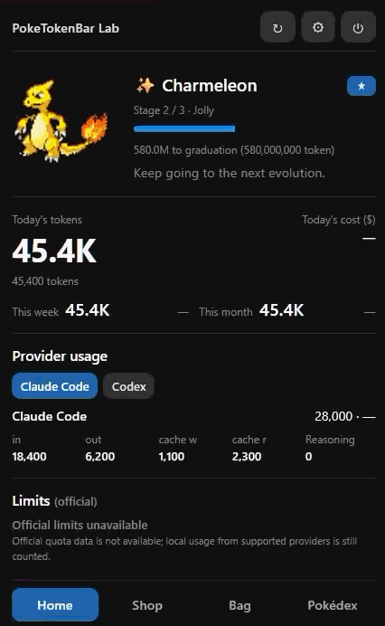<br>
        <strong>🏠 Home</strong>
      </td>
      <td class="screenshot-explanation">
        <strong>The place to start.</strong><br>
        Home brings the active egg or Pokémon, progress toward the next stage, usage totals, provider details, and the limits status into one compact panel. It opens from the tray and does not create a second taskbar button.
      </td>
    </tr>
    <tr>
      <td align="center">
        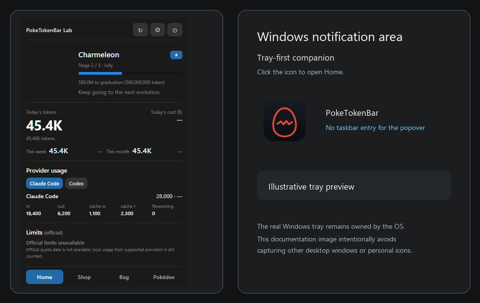<br>
        <strong>📍 Tray access</strong>
      </td>
      <td class="screenshot-explanation">
        <strong>A tray-first desktop flow.</strong><br>
        This is a neutral illustration of the entry point. The notification-area icon opens Home, the context menu can refresh or quit, and closing the panel leaves PokeTokenBar running quietly in the tray.
      </td>
    </tr>
    <tr>
      <td align="center">
        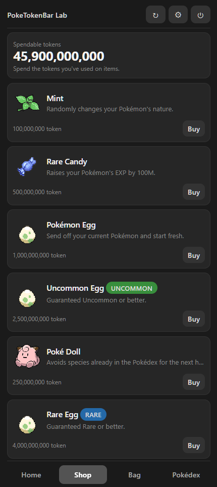<br>
        <strong>🛍️ Shop</strong>
      </td>
      <td class="screenshot-explanation">
        <strong>A place to spend progression tokens.</strong><br>
        Shop offers optional items such as a fresh egg, Rare Egg, Mint, Rare Candy, and Shiny Charm. Prices in the screenshot are demonstration values, not billing data or an account wallet.
      </td>
    </tr>
    <tr>
      <td align="center">
        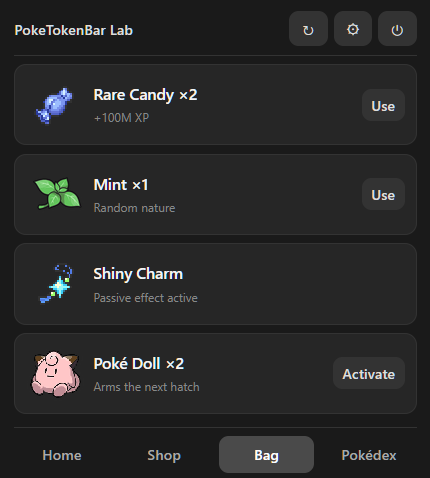<br>
        <strong>🎒 Bag</strong>
      </td>
      <td class="screenshot-explanation">
        <strong>Use what you have earned.</strong><br>
        Bag keeps the local item inventory in view and makes each action explicit. The counts shown here are synthetic and do not represent a real purchase history.
      </td>
    </tr>
    <tr>
      <td align="center">
        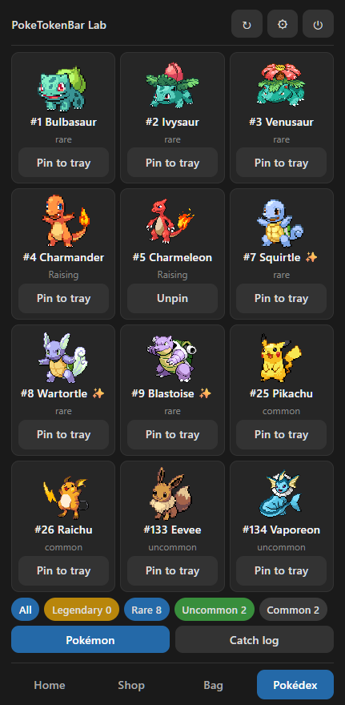<br>
        <strong>📖 Pokédex</strong>
      </td>
      <td class="screenshot-explanation">
        <strong>See the collection at a glance.</strong><br>
        The Pokédex records discovered stages, rarity filters, shiny ownership, and the representative Pokémon shown in the tray or floating companion. Selecting a species changes the companion display, not provider data.
      </td>
    </tr>
    <tr>
      <td align="center">
        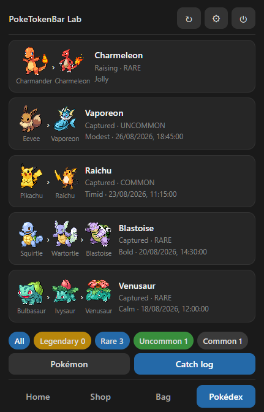<br>
        <strong>🗂️ Catch Log</strong>
      </td>
      <td class="screenshot-explanation">
        <strong>Keep each companion's story.</strong><br>
        Catch Log separates the active companion from graduated ones and shows the evolution chain, rarity, nature, and neutral demonstration dates for each individual.
      </td>
    </tr>
    <tr>
      <td align="center">
        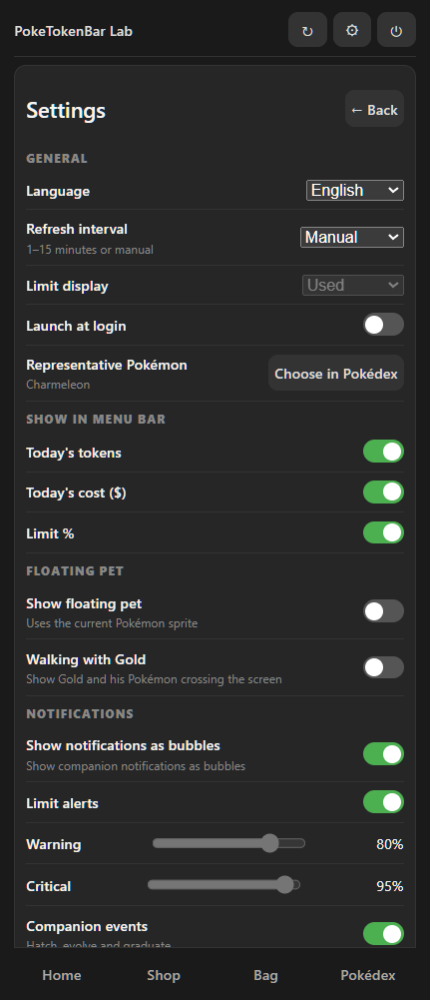
        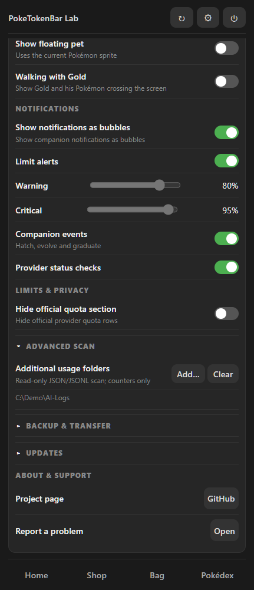<br>
        <strong>⚙️ Settings & progression</strong>
      </td>
      <td class="screenshot-explanation">
        <strong>The two Settings images belong together.</strong>
        <ul>
          <li><strong>General:</strong> choose the language, refresh cadence, limit display, launch-at-login behavior, and representative Pokémon.</li>
          <li><strong>Tray:</strong> decide which daily totals and limit details appear in the tray tooltip.</li>
          <li><strong>Companion:</strong> show or hide the floating pet, adjust its size, and enable the optional Gold walking overlay.</li>
          <li><strong>Updates:</strong> choose whether to receive update notices and check the release page.</li>
          <li><strong>Advanced scan:</strong> add extra JSON or JSONL folders. The `C:\Demo\AI-Logs` path is a synthetic example; these folders are read-only.</li>
        </ul>
        These controls change PokeTokenBar's own settings and progression display. They never modify Hermes or another provider's files.
      </td>
    </tr>
    <tr>
      <td align="center">
        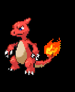<br>
        <strong>🫧 Floating companion</strong>
      </td>
      <td class="screenshot-explanation">
        <strong>A separate companion window.</strong><br>
        The optional pet can remain visible while Home is closed. It is transparent, excluded from the taskbar, and follows the selected representative without moving or resizing during a usage refresh.
      </td>
    </tr>
    <tr>
      <td align="center">
        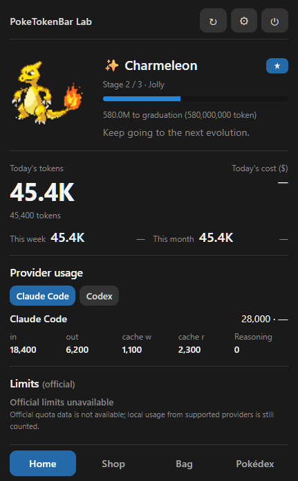<br>
        <strong>✨ Shiny state</strong>
      </td>
      <td class="screenshot-explanation">
        <strong>A rare result with its own visual language.</strong><br>
        This banner shows how the app presents a shiny companion and its notification moment. It is a static, synthetic documentation state.
      </td>
    </tr>
    <tr>
      <td align="center">
        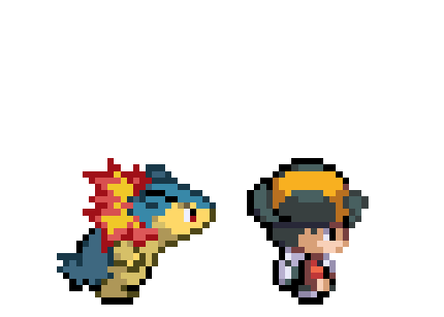<br>
        <strong>🚶 Gold walking overlay</strong>
      </td>
      <td class="screenshot-explanation">
        <strong>An optional ambient animation.</strong><br>
        Gold and his Pokémon can cross the screen independently from Home. The overlay is opt-in, has its own size control, and remains outside the taskbar.
      </td>
    </tr>
  </tbody>
</table>

See [`docs/SCREENSHOTS.md`](docs/SCREENSHOTS.md) for the complete image index and the rules used to keep documentation data anonymous.

## 🔌 Local sources

The app checks each source independently and skips locations that are not installed. The built-in readers currently cover:

- Claude Code
- Gemini CLI
- Antigravity
- Codex
- OpenCode
- Cursor
- Grok CLI
- GitHub Copilot CLI
- Kiro CLI
- Pi Agent
- Hermes Agent local SQLite usage

PokeTokenBar reads the usage metadata needed for totals and attribution. It does not need prompts or message bodies. Hermes data is opened read-only and remains compatible with a live SQLite WAL database.

Official quota values appear only when a local source provides them. If that data is unavailable, the interface says so instead of inventing a percentage or reset time.

## 🔒 Privacy and local data

PokeTokenBar is designed around local data:

- no telemetry or analytics service;
- no upload of usage data;
- no remote database;
- no SSH, Tailscale, or Home Assistant dependency;
- provider databases and log files are read-only;
- prompts, credentials, API keys, tokens, cookies, and connection strings are not stored in the repository or release assets;
- the companion's own progression state stays outside the repository in the normal application-data directory;
- an export is an explicit user action and should be treated as personal data.

The release audit rejects personal absolute paths, credential-looking values, local database files, logs, and companion state. More detail is available in [`SECURITY.md`](SECURITY.md) and [`RELEASE.md`](RELEASE.md).

## 📦 Install

The current release is `v0.1.0`.

1. Open the [Releases page](https://github.com/MarkusSela/PokeTokenBarWindows-Lab/releases).
2. Download `PokeTokenBar-Windows-Lab-Setup-<version>.exe`.
3. Verify the SHA-256 value with the attached `SHA256SUMS.txt`.
4. Run the installer. PokeTokenBar starts in the notification area; click its icon to open Home.

The current installer is not Authenticode-signed, so Windows SmartScreen may display a warning. Check the release source and checksum before installing.

## 🧰 Build from source

Requirements:

- Windows 10 or 11
- Node.js 22 or newer
- npm

```shell
npm ci
npm test
node --check main.cjs
npm run audit:release
npm run dist
```

The installer is written to `dist/PokeTokenBar-Windows-Lab-Setup-<version>.exe`. The unpacked application is written to `dist/win-unpacked/`.

For a clean verification run, close previous PokeTokenBar processes before rebuilding. The normal launch path stays tray-first; diagnostic opening is reserved for the documented `PTB_OPEN=1` test path.

## 🤝 Contributing

Issues and pull requests are welcome. Please:

- describe the smallest reproducible steps;
- use synthetic data whenever possible;
- do not attach provider logs, Hermes databases, prompts, credentials, cookies, or exported saves;
- preserve the tray-first lifecycle and the read-only provider boundary.

Start with [`CONTRIBUTING.md`](CONTRIBUTING.md) for the local test workflow.

## 🔗 Links

- [Project repository](https://github.com/MarkusSela/PokeTokenBarWindows-Lab)
- [Releases](https://github.com/MarkusSela/PokeTokenBarWindows-Lab/releases)
- [Report an issue](https://github.com/MarkusSela/PokeTokenBarWindows-Lab/issues/new)
- [Original PokeTokenBar project](https://github.com/chattymin/PokeTokenBar)

## 💛 Support

If PokeTokenBar is useful to you, you can support its maintenance on [Ko-fi](https://ko-fi.com/marukoshi). Support helps with upkeep, testing, and interface polish. It does not unlock features, and it never sends usage data anywhere.

## 🙏 Acknowledgments

Thanks to the original [PokeTokenBar project](https://github.com/chattymin/PokeTokenBar) for the companion concept and progression loop that inspired this build.

This project also uses:

- [Electron](https://www.electronjs.org/) for the desktop runtime;
- [PokéAPI](https://pokeapi.co/) and the [PokéAPI sprites repository](https://github.com/PokeAPI/sprites) for Pokémon data and imagery;
- the maintainers of the local AI tools whose usage formats make read-only aggregation possible;
- the testers and issue reporters who provide reproducible feedback without sharing private logs or credentials.

## 📄 License

The source code in this repository is released under the [MIT License](LICENSE). The license applies to this project's source code and does not grant rights to third-party trademarks, artwork, or data accessed through the app.

PokeTokenBar is an unofficial, non-commercial fan project. It is not affiliated with, endorsed, sponsored, or approved by Nintendo, Game Freak, Creatures Inc., or The Pokémon Company. "Pokémon" and related names, characters, and imagery belong to their respective owners.

The application is provided "as is", without warranty of any kind. This notice is not legal advice.
