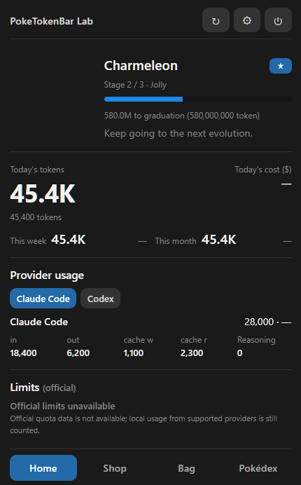

# PokeTokenBar Windows Lab


[](https://github.com/MarkusSela/PokeTokenBarWindows-Lab/actions/workflows/ci.yml)
[](https://github.com/MarkusSela/PokeTokenBarWindows-Lab/releases)
[](https://ko-fi.com/marukoshi)
[](LICENSE)

**Your local AI coding usage, hatched into a Pokémon companion — right in the Windows notification area.**

PokeTokenBar Windows Lab is an independent Windows companion inspired by the original [PokeTokenBar macOS project](https://github.com/chattymin/PokeTokenBar). It keeps the same idea — local AI coding usage becomes a small companion that hatches, evolves, graduates, and fills a Pokédex — while translating the menu-bar experience into a Windows-first tray application.

> **Private preview:** this repository and its first release are intentionally private while the Windows build is reviewed. Do not share its release links until the repository is made public.

## What it does

- Lives in the Windows notification area with a static, high-resolution app icon.
- Opens a compact Home popover from the tray without adding a separate taskbar button.
- Reads supported local usage data without modifying provider databases or logs.
- Tracks daily, weekly, monthly, and rolling-window local usage where the source provides it.
- Turns accumulated usage into an egg, an active companion, evolution stages, a Pokédex, and a Catch Log.
- Includes a Shop and Bag for the companion progression loop.
- Supports optional floating companion and walking overlay windows, both excluded from the taskbar.
- Includes an optional Gold walking overlay, controlled from Settings and kept outside the taskbar.
- Supports read-only additional scan folders selected by the user.
- Stores only the companion state in its own Windows application-data directory.
- Never requires a server, SSH, Tailscale, Home Assistant, or a remote usage service.

## Screenshots

All images below are **demo captures or neutral illustrations** made with synthetic values. They must never contain a Windows username, home path, prompt, credential, real usage total, real cost, database name, or personal project name.

<table>
  <tr>
    <th>Home and tray</th>
    <th>Companion windows</th>
  </tr>
  <tr>
    <td align="center"></td>
    <td align="center"></td>
  </tr>
  <tr>
    <td align="center"><br><br></td>
    <td align="center"><br><br></td>
  </tr>
  <tr>
    <td colspan="2" align="center"></td>
  </tr>
  <tr>
    <th colspan="2">Settings and progression</th>
  </tr>
  <tr>
    <td align="center"></td>
    <td align="center"></td>
  </tr>
  <tr>
    <td align="center"></td>
    <td align="center"></td>
  </tr>
</table>

The tray image is intentionally a safe documentation illustration rather than a capture of the user's real taskbar. The screenshot capture policy and exact acceptance list are documented in [`docs/SCREENSHOTS.md`](docs/SCREENSHOTS.md).

## Supported local sources

The reader checks for each source independently and silently skips sources that are not installed. Current adapters cover:

- Claude Code
- Gemini CLI
- Antigravity
- Codex
- OpenCode
- Cursor
- Grok CLI
- GitHub Copilot CLI
- Kiro CLI
- Pi Agent
- Hermes Agent local SQLite usage

The app reads only usage metadata needed for totals and attribution. It does not need prompts or message bodies. Hermes data is opened read-only and remains compatible with a live SQLite WAL database; the database is never changed by this app.

Official account quota values are shown only when a supported local source exposes them. Windows local-source usage is still useful when official limits are unavailable; the UI labels that distinction instead of inventing percentages or reset times.

## Privacy and local data

PokeTokenBar Windows Lab is deliberately local-first:

- no telemetry or analytics service;
- no upload of usage data;
- no remote database;
- no SSH, Tailscale, or Home Assistant dependency;
- provider databases and log files are read-only;
- prompts, credentials, API keys, tokens, cookies, and connection strings are not stored in the project or release;
- the app's own progression state is stored outside the repository under the normal Windows application-data directory;
- an optional export is a user action and must be treated as private data.

The release audit rejects personal absolute paths, credential-looking values, local database files, logs, and companion state. See [`SECURITY.md`](SECURITY.md) and [`RELEASE.md`](RELEASE.md).

## Install the private preview

1. Open the private [Releases page](https://github.com/MarkusSela/PokeTokenBarWindows-Lab/releases).
2. Download the Windows installer, named `PokeTokenBar-Windows-Lab-Setup-<version>.exe`.
3. Verify the SHA-256 value in `SHA256SUMS.txt` before installing.
4. Run the installer. The app starts tray-first; click the notification-area icon to open Home.

The preview installer may be unsigned. Windows SmartScreen can show a warning for an unsigned private build. Only install an artifact downloaded from the private repository or built locally from this source.

## Build from source

Requirements:

- Windows 10 or 11
- Node.js 22 or newer, matching the version used by CI
- npm

```shell
npm ci
npm test
node --check main.cjs
npm run audit:release
npm run dist
```

The installer is written to `dist/PokeTokenBar-Windows-Lab-Setup-<version>.exe`. The unpacked application is written to `dist/win-unpacked/`.

For a clean verification run, close every previous PokeTokenBar Windows Lab process before rebuilding. The normal launch path is tray-first; diagnostic opening is available only through the documented `PTB_OPEN=1` test path.

## Release policy

The Windows release is kept separate from the macOS repository. The recommended GitHub release contains only:

- the NSIS installer `.exe`;
- `SHA256SUMS.txt`;
- a short release note with tested version, test count, audit result, and known unsigned-installer warning.

Do not upload:

- `companion-state.json` or any exported save;
- Hermes `state.db`, WAL/SHM files, provider logs, caches, prompts, or screenshots from a personal machine;
- `.env`, certificates, keys, tokens, credentials, or connection strings;
- `node_modules/`, diagnostic output, or personal build directories.

The detailed checklist is [`RELEASE.md`](RELEASE.md). The first publication is a private preview; public visibility is a separate decision after review.

## Links

- **Windows repository:** [MarkusSela/PokeTokenBarWindows-Lab](https://github.com/MarkusSela/PokeTokenBarWindows-Lab)
- **Windows releases:** [Releases](https://github.com/MarkusSela/PokeTokenBarWindows-Lab/releases)
- **Issues:** [Report a problem](https://github.com/MarkusSela/PokeTokenBarWindows-Lab/issues/new)
- **Original macOS project:** [chattymin/PokeTokenBar](https://github.com/chattymin/PokeTokenBar)
- **Support future ports:** [Ko-fi](https://ko-fi.com/marukoshi)

## Acknowledgments

Thank you to the original PokeTokenBar project for the companion concept, progression loop, and reference behavior that inspired this Windows implementation.

This project also relies on the work of:

- [Electron](https://www.electronjs.org/) for the desktop runtime;
- [PokéAPI](https://pokeapi.co/) and the [PokéAPI sprites repository](https://github.com/PokeAPI/sprites) for runtime Pokémon data and imagery;
- the open-source maintainers of the local AI tools whose usage formats make read-only aggregation possible;
- everyone who tests the private preview and reports reproducible issues without including private logs or credentials.

Donations through [Ko-fi](https://ko-fi.com/marukoshi) help fund maintenance and future companion apps for **Windows, iOS, Android, Linux, and other platforms**. A donation is optional and does not unlock features or send usage data anywhere.

## License and disclaimer

The original source code in this repository is released under the [MIT License](LICENSE). The license applies to this project's source code and does not grant rights to third-party trademarks, artwork, or data accessed through the app.

PokeTokenBar Windows Lab is an unofficial, non-commercial fan project. It is not affiliated with, endorsed, sponsored, or approved by Nintendo, Game Freak, Creatures Inc., or The Pokémon Company. “Pokémon” and related names, characters, and imagery belong to their respective owners.

The application is provided “as is”, without warranty of any kind. This notice is not legal advice.
